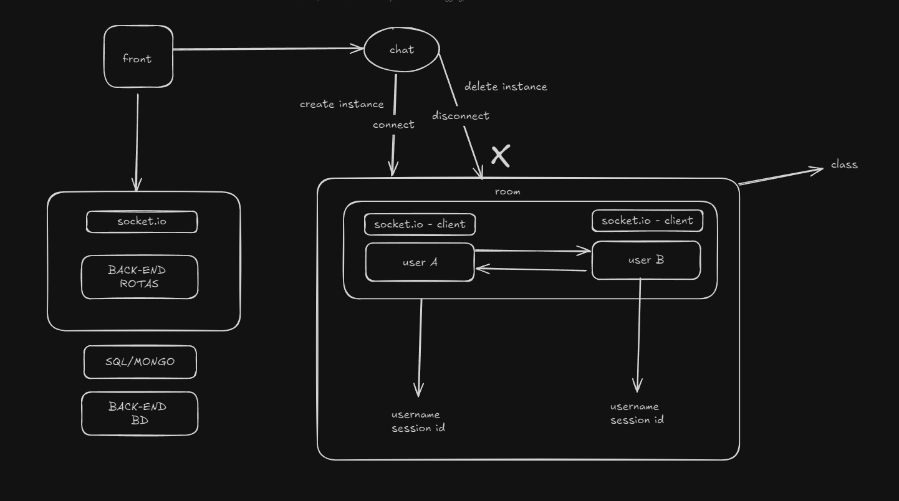

# Redstar unrealchat

## Badges

<p align="center">
  
  
  
  
  
  
  
  
  
  
  
  
  
  
  
  
  
</p>


This is a [Next.js](https://nextjs.org/) project bootstrapped with [`create-next-app`](https://github.com/vercel/next.js/tree/canary/packages/create-next-app).

## Use case



## routes

- **create user [POST]** : ```v1/users/register```
- **login user [POST]** : ```v1/users/login```

<br/>

## Getting Started fullstack

First, run the development server for nextjs:

```bash
  # installing modules
  npm i

  npm run dev
  # or
  yarn dev
  # or
  pnpm dev
  # or
  bun dev
```

Open [http://localhost:3000](http://localhost:3000) with your browser to see the result.
<br/>

Then, run the development server:

```bash
  # installing modules
  cd server
  npm i

  npm run dev
  # or
  yarn dev
  # or
  pnpm dev
  # or
  bun dev
```

Open [http://localhost:5232](http://localhost:5232) with your browser to see the result.

### TODO

- [] getAll users
- [] logout user route
- [] delete user route
- [] create chatroom instance
- [] user login page (frontend)
- [] user homepage (frontend)